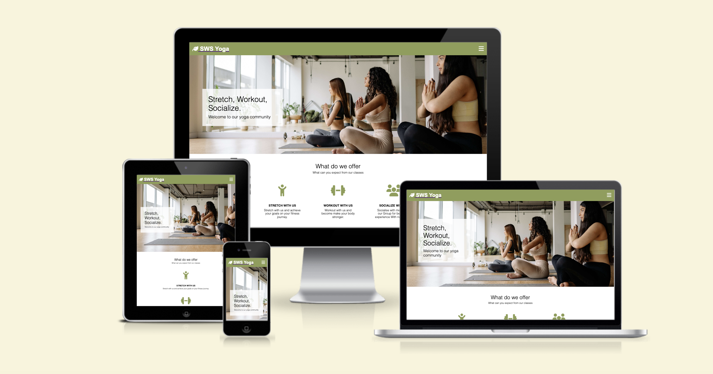
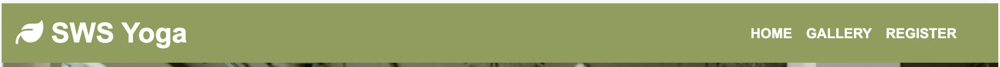
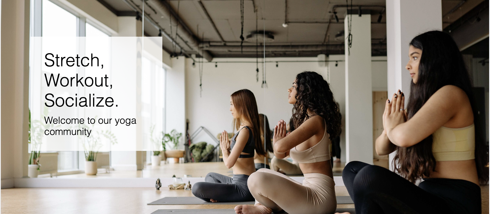
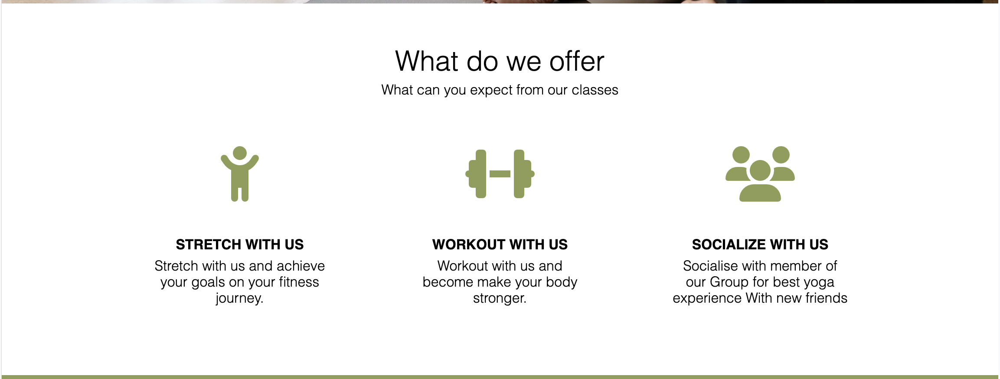
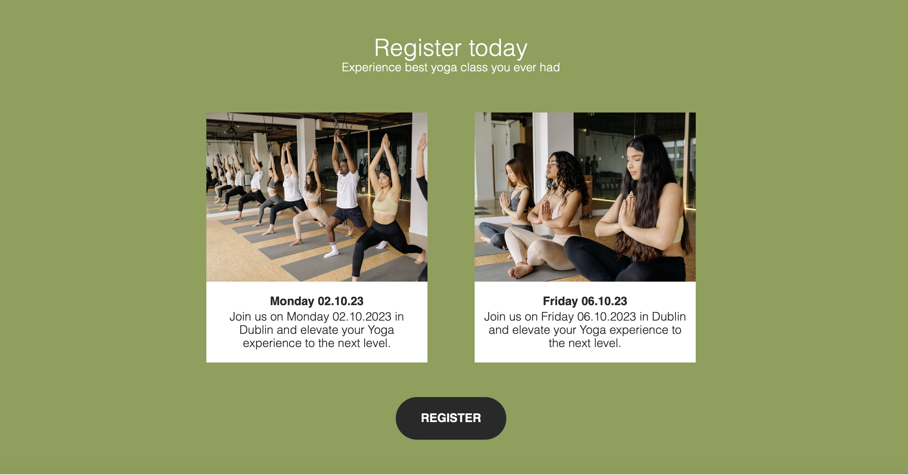
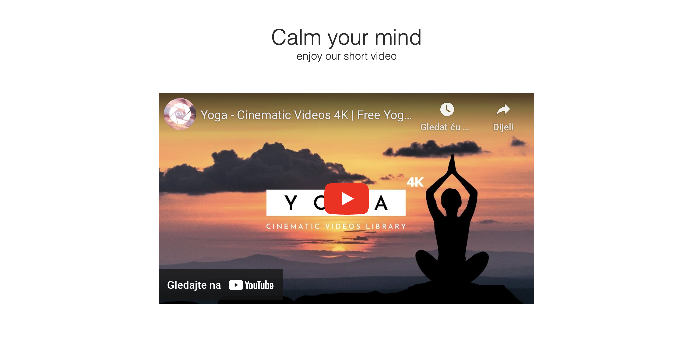
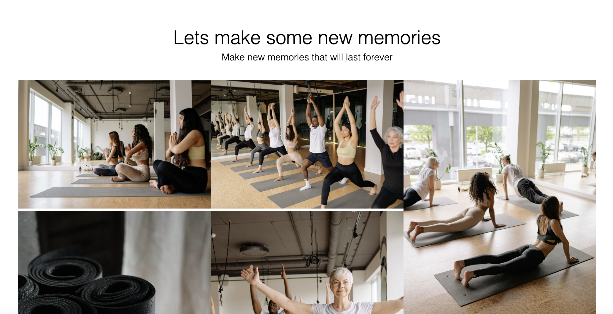
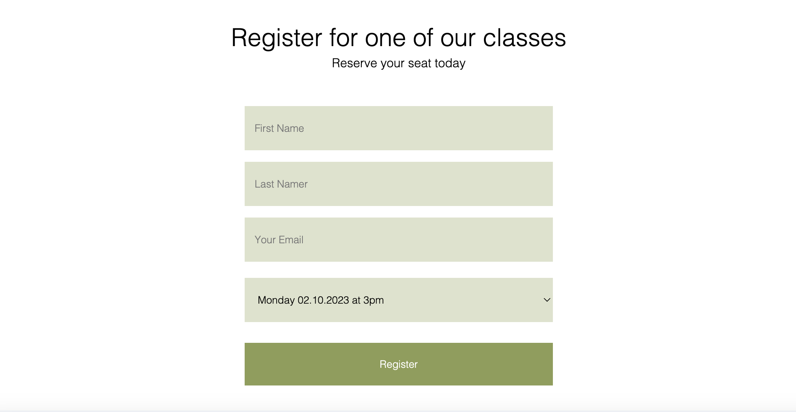
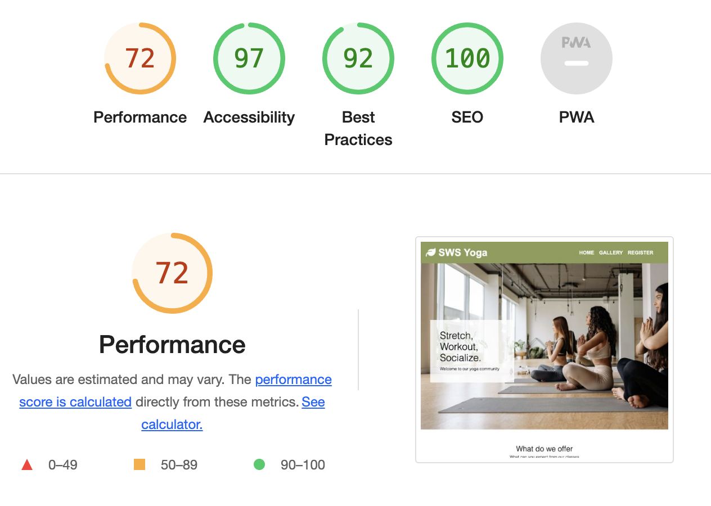

# SWS Yoga Website

SWS Yoga website is a website for all yoga enthusiast who would like to find new space and socialize with new people while stretching and working out.
Purpose of this website is to present information about our yoga studio to potential clients and help them register for our classes.

Users of this website will be able to find all the relevant information about the classes, see our gallery and register for the upcoming classes. Through this website users can also access our social media and see a short motivational video that will definitely get them thinking about joining our yoga session.

SWS website is created to be short and to the poin, user should have clear understanding off all the information and how to register for our services.

## Features

**Navigation**

* Features at the top of the page, it consists of the logo and the name on the left side that links to the main page.
* Navigation links are on the right side: Home, Gallery and Register which links to separate pages on the website.
* Navigation is clearly marked with hamburger menu and with just a text on larger screens. 
* Navigation links are in white color so they stand out from the background.

**The Header**

* The header gives a clear picture of what enviroment our clients can expect when they arrive to our class.
* It shows a big picture of our class and clients that should motivate future clients to join.
* Also it contains a short message for our future clients.

**About Us**

* The about us section gives a client a better understanding of what separates us from other yoga classes.
* About us section is created using icons and small text for better understanding what is it we provide.

**Register section on the main page**

* There are two register sections on the website, one is on the main page and one is a separate page.
* Register section on the main page serves to preset to client with the information about the classes, date and time, it also features a register button that will take out clients to separate register page.

**Video**

* Video section on the paige is created to give clients motivation and to show them some yoga positions they will be learning in the acctual class.

**Social media**

* Social media links are provided in the footer of the page where our client can find our social media accounts.

**Gallery page**

* Gallery page is created to feature our client and our classes.
* This is a page where future client can see class invironment. 
* This is a page where we share top quality photos for our clients to use on their social media.

**Register page**

* Register page is created to be as simple as posible.
* It contains a form with input fields for name, email and class selection box.
* In register page our future clients can register for upcomming classes.

## Testing

* I tested that this page works in different browsers Chrome, Safary, Firefox.
* I confirm that this project is responsive, looks good and functions on all standard screen sizes using the devtools device toolbar.
* I confirm that all navigation, header, about us, registration and social media text is readable and easy to understand.
* I have confirmed that the form works: requires entries in every field, will only accept the email in email field, and the register button works.

## Bugs

* No bugs were found on the page.

## Validator test

1. HTML
   * No errors were detected when running the code trough official W3C validator

2. CSS
   * No errors were detected when running the code trough official (Jigsaw) validator

3. Accessibility
   * I confirmed that the colors and font I used are easy to read and accessible by running it trough lighthouse in devtools.

## Unfixed bugs

* Nounfixed bugs

## Deploiment

* The site is deployed to github pages:
